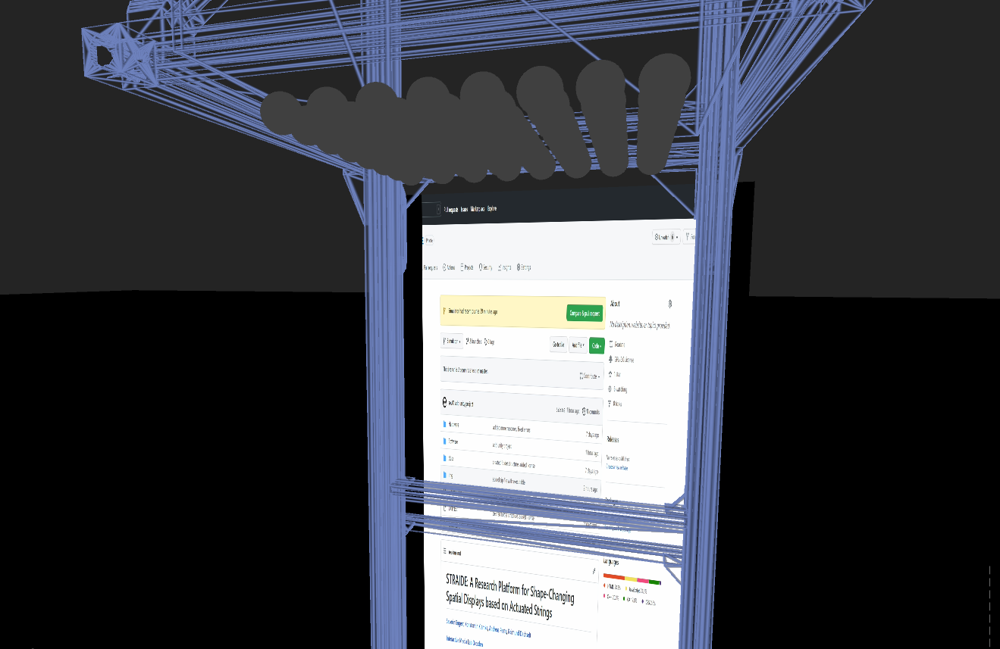
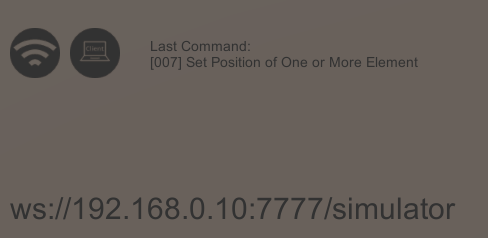

# Platform Emulator

The **Platform Emulator** can be used to test your applications. It emulates the full device and its behavior. Upon start, the application sets up a WebSocket server, that can be accessed from the same device or the local network. It will take and answer all incoming messages just like the original device (only low-level communication). The resultant behavior of the device is instantly visible. Use it to test your application before trying it on the real SCI.

The Platform Emulator can either be started as a standalone [Application](PlaformEmulator.zip) or opened as a [Unity Project](Unity).

## Application
The _Application_ folder contains a Windows Standalone **Simulator.exe** that can be executed. The Platform Emulator should start as a windowed application, which can be adjusted to your setup.

**Common Problems:**

1. The application sets up a WebSocket server on the localhost of your system with port 7777. If this address is already taken, the server will throw an error and the application will not start properly.
2. If you want to access the WebSocket server from your local network, the address with the assigned port needs to be accessible. Windows Firewall tends to block unknown ports. More information on how to set up inbound and outbound rules for Windows Firewall can be found [here](https://www.tomshardware.com/news/how-to-open-firewall-ports-in-windows-10,36451.html). To check for errors, run `netstat -an` in the Windows PowerShell and check for existing connections with port 7777, like 0.0.0.0:7777, _yourIP_:7777, or ::::7777.

## Unity Project
The **Unity** folder contains the full Unity project for the Platform Emulator. You should start the Unity Hub and add the folder to your projects. Select a fitting Unity Version (currently 2020.1.11f1) and open the project. The Platform Emulator can be run directly from the Unity Editor. WebSocket Server or Port problems are less common, as they are tunneled through the Unity ports 50XXX.

# Functionality

The core of the Platform Emulator is the digital model of the device with its 64 spheres. Their position and color relate to the current state of the SCI which can be altered by incoming messages.

**Limitations:**
- speed parameter is approximated, slow speeds use workaround with jitter
- color rendering might be different than with the original device

## Controls

The space around the display can be navigated by using the WASD keys to move around, the QE keys to move up and down, the scroll wheel to zoom and the left mouse button to look around.

Further keys used as follows: 
1,2,3,4,5 - predefined camera positions 
0 - toggle frame 
P - pick display 
L - toggle light 
O - toggle strings 
ESC - exit application

## Interaction

By hovering the mouse above an outer non-moving element, it gets selected. The position of a selected element can be manually altered using the primary mouse button.

## Strings

Using the **O** key, strings and cables can be toggled. They are connected to each element and move in accordance, although applied line renderer is a bad approximation.

## Lights

Using the **L** key, environmental light can be toggled for improved realism.

## Displays

For some applications, it was nice to have a background image or so inside the Platform Emulator. Therefore, it features multiple canvases to which a camera can be streamed, most often used with a virtual cam transferring parts of the screen. Use **P** to toggle the canvas.

## Supplementaries

Status information is displayed in the lower part of the screen.
The first icon shows the Platform Emulators connectivity. The second icon shows whether a client is connected or not. On its right, the last inbound command is displayed according to the message's ID. To learn more about the messages, see [Protocol](../../Hardware/protocol.md).
The empty space underneath the icons is filled with log/error messages, as they occur. This can be used for Debug purposes, e.g. a warning is displayed if an inbound message had the wrong length or format.

In the lower-left corner, the address of the WebSocket server is displayed. It needs to be entered into the SCIClients address field.

The lower-right corner shows the target position values for all 64 elements.